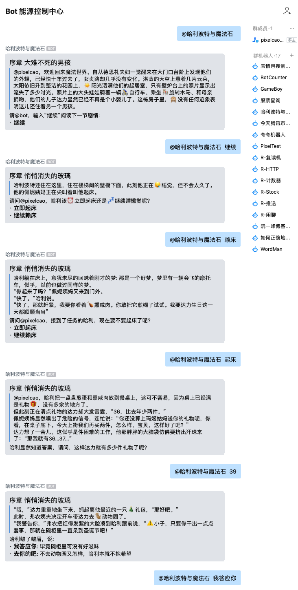
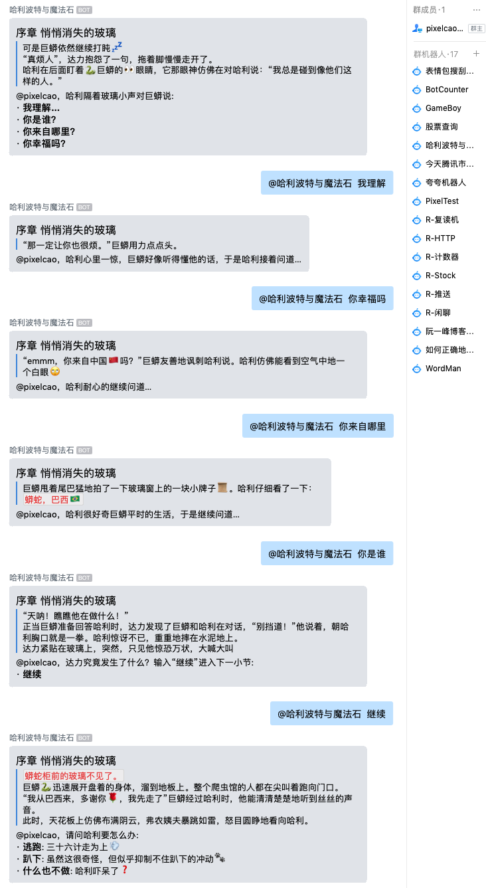
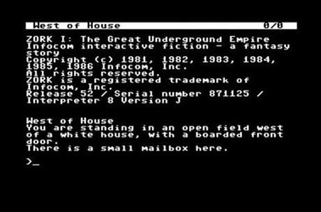
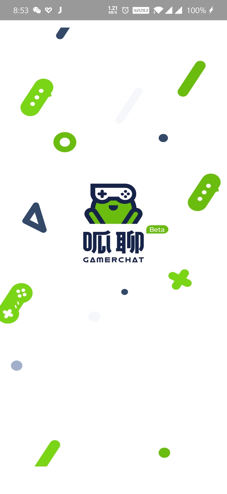

# 用 Bot 复刻经典——哈利波特与机器人

[TOC]

## 楔子

几乎每个90后，都曾梦想过作为一名🔯魔法师，进入霍格沃茨的校园；都曾经想象自己置身哈利波特的剧情中，或是作出🎲改变魔法世界的决策、或是体会⛳魁地奇的欢乐、或是去充满危险的🐸禁林里冒险。

现在，让我们以 `Bot` 的形式，梦回童年的魔法世界，自己就是哈利，试试看你的决策，会书写出怎样的故事。





## 缘起

记得《生活大爆炸》里两次提到了文字冒险游戏：Zork。

第一幕是 Penny 在 Sheldon 他们公寓门口邂逅时：


第二幕是 Leonard 准备和 Raj 的妹妹共度良宵时，Sheldon 一直在客厅玩 Zork 卡关了不肯睡觉，Leonard 糊弄他一直往东走，告诉他迷路了。



这个就是 Zork 的游戏界面，生于上世界 80 年代，在 GUI 还没诞生的时候人们就在终端上，开发出这种文字冒险类的游戏。

**文字冒险游戏**的精髓，就在于让用户对千差万别的输入文字给出的不同效果感到惊奇，通过作出**开放式的选择**，来**推进剧情**。就像 Sheldon 所说：

> 文字冒险游戏使用了世界上最强大的 GPU：**想象力**。

一直到今天，二葱着手构建 Bot 开发平台的工作时，忽然想到，有了 Bot 之后，这些文字冒险游戏又可以复活了。

不同于当年的文字冒险游戏，用 Bot 来承载的话，会有这些好处：

- 传播性：在群聊中通过 @bot 的方式玩游戏，能起到示范作用，有种文字直播的感觉，大家都能看得到
- 富文本：这个时代有 `markdown✍️` 和 `emoji😄`，纯文本不再是 `poor style` 的代名词，你可以用纯文本编织出丰富的画面，图、文、表皆备
- Any time，Any where：就像“云游戏”所承诺给大家的一样，你可以随时打开企业微信，只不过这次不是<font color="red">**聊工作**</font>，而是<font color="red">**玩游戏**</font>，而且，你的存档会保存在云端，**任何设备**、**任何时候**都能随时继续游戏

二葱沉思很久，感觉自己并没有编写剧本的才能，决定复刻一些经典作品：哈利波特、福尔摩斯探案、逆转裁判……

回想童年，霍格沃茨、对角巷、厄里斯魔镜、魁地奇的画面历历在目，决定首先复刻哈利波特系列。而且既然源代码是开源的，大家也能根据喜好创作自己喜欢的剧本。

## 创作

为了拟定游戏引擎的需求，二葱周末云通关了前阵子火热的游戏《隐形守护者》。边看，边想，我现在实现的游戏引擎能不能满足剧情需要。

经过一些来来回回的修改，敲定的需求单如下：

- 引擎要支持章节跳转
- 要提供变量机制，变量能动态的触发剧情
- 要抽离出引擎和剧本的关联，剧情元素均通过剧本文件来配置
- 每个用户输入，要能触发一个或一组行为，这些行为包括但不限于
  - 章节跳转
  - 关卡提示
  - 变量修改
- 游玩形式至少两种
  - 直接在控制台中游玩（面向开发者）
  - 在 IM 产品中游玩（面向多个平台的用户）

### 1. 代码结构

工蜂链接🔗：<https://git.code.oa.com/pixelcao/HarryPotter>

```bash
├── game_offline.js  		# 进行游戏
├── package.json
├── play.js     				# 对局逻辑
├── save_offline.js     # 存档逻辑
├── script.yaml 				# 剧本（YAML 是最好的配置文件！！！）
└── script_loader.js    # 加载 yaml 剧本的工具（默认）
```

拉到代码后，准备一个 `node.js` 的运行环境，然后运行 `game_offline.js` 即可：

```bash
npm install
node game_offline.js
```

### 2. 游戏机制

游戏机制基于舞台、章节、选择、行为和动态条件。

舞台是由章节组成的，每节都有剧情描述和几种选择，引擎会把用户输入的指令进行关键词匹配，来命中一种选择。这种选择会有对应的行为，行为包括：

- 章节跳转
- 变量增减
- 流程控制

除了显示声明章节跳转，还可以编写动态条件。动态条件的表达式通常跟变量有关，比如 `fubao > 5`，每当触发变量增减的行为后，引擎就会检查动态条件，如果`fubao(福报)`值满足条件，就会触发该动态条件所对应的行为，该行为依然可以是章节跳转、变量增减、流程控制等。

文字冒险游戏的精髓，就在于让用户对千差万别的输入文字给出的不同效果感到惊奇，通过作出开放式的选择，来推进剧情。就像 Sheldon 所说：

> 文字冒险游戏使用了世界上最强大的 GPU：想象力。

### 3. 剧本格式

游戏剧本是 `script.yaml` ，其 loader 是 `script_loader.js`，每个回合的处理引擎是 `play.js`，最终呈现出来的交互入口是 `game_offline.js`，很明显，与之对应的还应该有一个 `game_online.js`（提供 bot 形式的游玩界面），但目前还没提交上来。

目前你能在剧本中配置如下内容：

- 舞台：该字段名为`stages`，由一系列**章节**`chapters`构成
- 章节：由**故事** `story`、**选项**`choices`组成，每个选项都包含**关键词**`keywords`、**描述**`description`、**行为**`action`、**参数**`param`
- 变量：该字段名为 `variables`，是一个列表，可以在此处声明变量，然后：
  - 根据玩家的输入，编辑剧情内的分支选项`choice`，设置行为`action`，来改变变量的值
  - 根据变量的值，编辑动态条件`dynamics`，设置条件`conditions`，来触发一定的行为`action`
- 动态条件：该字段名为 `dynamics`，提供与变量相关的动态功能
- 默认区：该字段名为 `defaults`，当玩家输入没有匹配任何章节内的分支选项时，流程会走到默认区，默认区一般提供如下功能：
  - 帮助信息：帮助信息没必要在每个章节中配置成选项，可以放到默认区来配置
  - 特殊指令：全局流程性的指令，可以放到这里，比如开始游戏、重置进度等
  - 默认回复：当玩家随意输入内容时，也需要有一个友好回复，就在此处配置

#### 3.1 剧情示例

以哈利波特与魔法石为例，剧情配置如下，变量区声明了6个变量：

- rounds，表示回合数，这是个特殊变量，即便不做配置，引擎也会每个回合自动给这个变量+1
- health，健康值，剧情选项会操作该变量，当健康值归零时，可以触发动态条件（Game Over）
- qsnake，这个变量用来记录某个情节中，哈利与巨蟒对话的次数，当此数值达到 4 时，可以触发动态条件（章节跳转）

在分支选项中，由如下字段需要解释：

- keywords，该选项要匹配的关键字
- description，如果该选项触发了分支跳转，则显示下一章节的剧情；如果没触发，则显示这个字段配置的内容
- action，动作类型：
  - none，什么也不做，直接给用户显示 description 字段的内容
  - goto，章节跳转，跳转后给用户显示新章节的剧情，param 填章节序号
  - incr，变量自增，param 填变量名
  - decr，变量自减，param 填变量名
  - calc，复杂变量运算，param 填变量修改后的表达式（如`(qsnake>=4)?0:qsnake`）
  - reset，重置剧情到 “1.1”，一般不会使用该动作

```yaml
title: 哈利波特与魔法石
msgtype: markdown
# 变量: 可以记录某些变量的值、动态触发某些章节
variables: [rounds, credit, study, love, health, qsnake]
# 舞台: 由不定数量的章节组成游戏本体
stages:
  "1.1":
    # 章节名称，会显示在消息标题的位置
    chapter: 序章 大难不死的男孩 
    # 本节剧情
    story: |-
      > @sender，欢迎回来魔法世界。自从德思礼夫妇一觉醒来在大门口台阶上发现他们的外甥，已经快十年过去了，女贞路却几乎没有变化。湛蓝的天空上悬着几片云朵，太阳依旧升到整洁的花园上，☀️阳光洒满他们的起居室，只有壁炉台上的照片显示出流失了多少时光。照片上的大头娃娃骑着一辆🚴自行车、乘坐🎠旋转木马、和母亲拥吻，他们的儿子达力显然已经不再是个小婴儿了。这栋房子里，🙈没有任何迹象表明这儿还住着另一个男孩。
      
      请@bot，输入“继续”阅读下一节剧情: 
      - **继续**
    # 输入选项: 关键词匹配，用户输入若含有该词，视为选择了此选项
    choices:
      # 关键词
      - keywords: [继续, 下一步, continue, next]
      # 描述: 若选项行为没有触发章节跳转，则显示描述消息
        description: ""
      # 行为: goto、none、incr、decr、calc，分别是章节跳转、无、变量自增、变量自减、变量运算
        action: [goto, calc]
        param: ["1.2", "health+7"]
```

#### 3.2 动态条件示例

以**健康值减到0时，自动GameOver章节: 12.1**为例，需要配置动态条件如下：

```yaml
# 动态条件: 输入选项结算后，会检查动态条件，若条件成立，则执行操作
dynamics:
  - conditions:
      chapter: "1.*"
      expression: health <= 0
    action: goto
    param: "12.1"
```

#### 3.3 默认回复示例

以帮助文档、重置章节、和 fallback 回复为例，需要配置默认区如下：

```yaml
# 默认区: 当用户输入没有命中章节内所覆盖的选项时，走到这里
defaults:
  # 条件: 满足章节条件或关键词条件，则触发该默认行为
  - conditions:
      chapter: "*"
      keywords: [help, man, 帮助, 怎么玩, 你是谁]
    action: none
    description: |-
      > @sender，欢迎来到`@title`，这是一个`文字冒险游戏`，你通过输入`动作`或`指令`来推进剧情、获取帮助。
      > 几乎每个90后，都曾梦想过作为一名🔯魔法师，进入霍格沃茨的校园；都曾经想象自己置身哈利波特的剧情中，或是作出🎲改变魔法世界的决策、或是体会⛳魁地奇的欢乐、或是去充满危险的🐸禁林里冒险。
      > 现在，让我们以bot的形式，梦回童年的魔法世界，自己就是哈利，试试看你的决策，会书写出怎样的故事。
      > 每个人都有`独立的进度和存档`，建议拉到小群中调戏和游玩呢😄
      
      游戏基本操作如下: 
      - **继续游戏**: 直接@我即可
      - **开始游戏**: start
      - **帮助**: help、man
      - **提示**: hint
      - **重置**: reset
  - conditions:
      chapter: "*"
      keywords: [hint, 提示]
    action: none
    description: "@sender，本小节没有提示😂"
  - conditions:
      chapter: "*"
      keywords: [reset, start, 重置, 回到开始, 重新开始, 开始游戏]
    action: reset
    description: "重置章节"
  - conditions:
      chapter: "*"
      keywords: []
    action: none
    description: "> 先生实在抱歉，可是你说话好像一个麻瓜🌚🌝"
```

## 承载

虽然引入了存档的概念，但 Bot 的实现其实是 <font color="red">**无状态**</font> 的。

无状态也就意味着，只要存档集中存储在一个地方，Bot 可以自动扩容、缩容。既然如此，那我为什么还要自己准备服务器？有没有一个地方，能托管运行我的 Bot 代码？

再次提问🙋，其实众多 IM 产品的 Bot 接口，都只是提供一个你可以主动调用的 CGI 接口（**推送消息**）、还有一个平台方调用你的 CGI 接口（**接收消息**）。每个平台都有自己的协议约定、加密方式，有没有一种方法，可以让 Bot 实现一次开发、在多个 IM 产品上运行？

这就是本小节的主题：**承载**。

但单是这一小节的主题，就足以开一个专栏写很多长篇文章了。在这里二葱只做一个预告，来自 IEG 游戏平台部 的产品：**呱聊**，即将上线～

呱聊产品的大杀器之一，就是开放、自由的 Bot 平台。一次编写、随处运行的梦想，我们能帮你实现🌝

>  excited！



## 尾声

目前 Bot 的剧本已经完成了第一部分：大难不死的男孩、悄悄消失的玻璃。

大家可以私聊我，建个小群、我把 Bot 拉到里面给大家体验。

谨献给每个童年时代的哈迷～